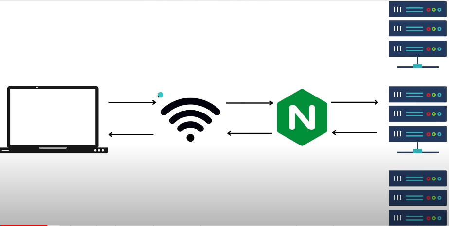

# folder structure
  - fruts | vegetables | about.html | index.html | styles.css are only serving html.
  - server is docker with node:16
  - images is folder of markdown.

# What is Nginx
    - that served web content to browser. ( some how -> web server).

# How internet works (low user traffic)
  - request => laptop -> wifi -> server(single server)
  - response => laptop <- wifi <- server(single server)
  
 # How Nginx works (high user traffic) 
   - request => laptop -> wifi -> nginx -> server
   - response => laptop <- wifi <- nginx <- server (reverse proxy)

- nginx will choose or allocate server to client (load balancer.)
- We can scale our application if user limit increases.
- we can encrypt or decrypt from nginx rather than every server. (https)
- Used for reverse proxy or http/https cache.

# How to install nginx for linux
  - sudo apt udpate
  - sudo apt install nginx
  - check localhost in broswer
  - check /etc/nginx

# Run nginx
  - sudo nginx

# Restart nginx
  - sudo nginx -s reload
  - sudo service nginx restart

# Nginx terminology
  - user www-data; -> directive
  - events { worker_connections 768;} -> context
  - directive inside context.

# TO get permission to edit /etc/nginx files
  - sudo chown -R username directory_name

# Nginx load balancer
  - in server folder README.md